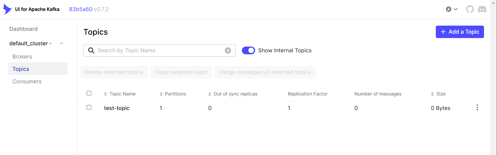

# Deploy Kafka And UI Guide

Guide for deploying a Kafka server and a Kafka UI using Docker.  

## Overview

- Message Quene: Kafka v3.2.0
- UI: Provectuslabs/kafka-ui v0.7.2

## Environment Setup

### server.properties
- modify the `advertised.listeners` setting to match your machine's external IP.

**Note**: The `server.properties` file is mounted as a volume, so you don't need to rebuild the Docker image after modifying `advertised.listeners`.  

### docker-compose
- set the `KAFKA_CLUSTERS_0_NAME` parameter to the desired cluster name.

## Run

### Build Image

```bash
docker build -t kafka-server .
```

### Run in Docker
```bash
docker compose up -d
```

server running at `localhost:9092`  
ui running at `localhost:8080`  

## UI

